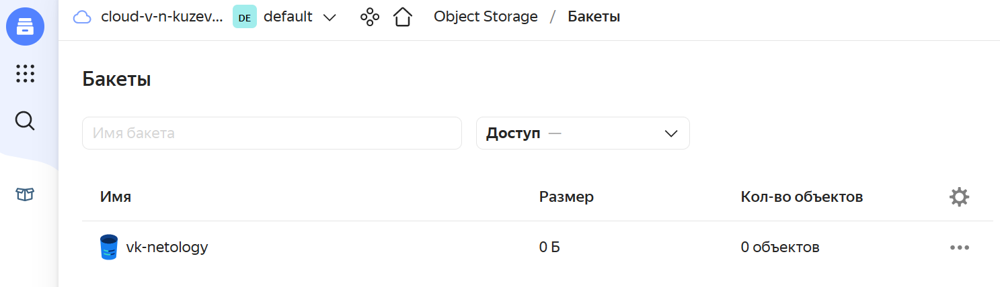
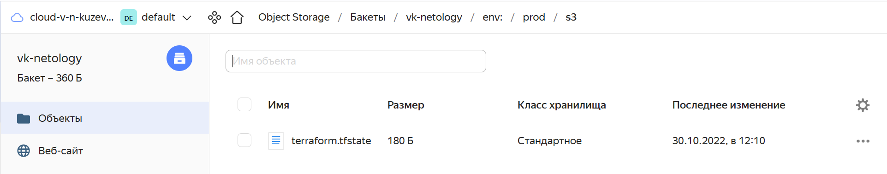

# Домашнее задание к занятию "7.3. Основы и принцип работы Терраформ"

## Задача 1. Создадим бэкэнд в S3 (необязательно, но крайне желательно).

Если в рамках предыдущего задания у вас уже есть аккаунт AWS, то давайте продолжим знакомство со взаимодействием
терраформа и aws. 

1. Создайте s3 бакет, iam роль и пользователя от которого будет работать терраформ. Можно создать отдельного пользователя,
а можно использовать созданного в рамках предыдущего задания, просто добавьте ему необходимы права, как описано 
[здесь](https://www.terraform.io/docs/backends/types/s3.html).
1. Зарегистрируйте бэкэнд в терраформ проекте как описано по ссылке выше. 


## Решение


## Задача 2. Инициализируем проект и создаем воркспейсы. 

1. Выполните `terraform init`:
    * если был создан бэкэнд в S3, то терраформ создат файл стейтов в S3 и запись в таблице 
dynamodb.
    * иначе будет создан локальный файл со стейтами.  
1. Создайте два воркспейса `stage` и `prod`.
1. В уже созданный `aws_instance` добавьте зависимость типа инстанса от вокспейса, что бы в разных ворскспейсах 
использовались разные `instance_type`.
1. Добавим `count`. Для `stage` должен создаться один экземпляр `ec2`, а для `prod` два. 
1. Создайте рядом еще один `aws_instance`, но теперь определите их количество при помощи `for_each`, а не `count`.
1. Что бы при изменении типа инстанса не возникло ситуации, когда не будет ни одного инстанса добавьте параметр
жизненного цикла `create_before_destroy = true` в один из рессурсов `aws_instance`.
1. При желании поэкспериментируйте с другими параметрами и рессурсами.

В виде результата работы пришлите:
* Вывод команды `terraform workspace list`.
* Вывод команды `terraform plan` для воркспейса `prod`.  


## Решение

```bash
vk@vkvm:~/DZ7.3$ terraform init

Initializing the backend...

Successfully configured the backend "s3"! Terraform will automatically
use this backend unless the backend configuration changes.

Initializing provider plugins...
- Reusing previous version of yandex-cloud/yandex from the dependency lock file
- Using previously-installed yandex-cloud/yandex v0.81.0

Terraform has been successfully initialized!

You may now begin working with Terraform. Try running "terraform plan" to see
any changes that are required for your infrastructure. All Terraform commands
should now work.

If you ever set or change modules or backend configuration for Terraform,
rerun this command to reinitialize your working directory. If you forget, other
commands will detect it and remind you to do so if necessary.
---
vk@vkvm:~/DZ7.3$ terraform workspace new stage
Created and switched to workspace "stage"!

You're now on a new, empty workspace. Workspaces isolate their state,
so if you run "terraform plan" Terraform will not see any existing state
for this configuration.
vk@vkvm:~/DZ7.3$ terraform workspace new prod
Created and switched to workspace "prod"!

You're now on a new, empty workspace. Workspaces isolate their state,
so if you run "terraform plan" Terraform will not see any existing state
for this configuration.
vk@vkvm:~/DZ7.3$ terraform workspace list
  default
* prod
  stage
vk@vkvm:~/DZ7.3$ terraform plan
data.yandex_compute_image.ubuntu_image: Reading...
data.yandex_compute_image.ubuntu_image: Read complete after 4s [id=fd8egv6phshj1f64q94n]

Terraform used the selected providers to generate the following
execution plan. Resource actions are indicated with the following
symbols:
  + create

Terraform will perform the following actions:

  # yandex_compute_instance.vm-1-count[0] will be created
  + resource "yandex_compute_instance" "vm-1-count" {
      + created_at                = (known after apply)
      + folder_id                 = (known after apply)
      + fqdn                      = (known after apply)
      + hostname                  = (known after apply)
      + id                        = (known after apply)
      + metadata                  = {
          + "ssh-keys" = <<-EOT
                ubuntu:ssh-rsa AAAAB3NzaC1yc2EAAAADAQABAAABgQDcfz96Ey9iHwu71K+2lUsbhUiDnk49yoPzYV0FYoDYU9drIk5gCqlVhpt9EXziq+X1MR0z8JLhHOXSr+A+2xtlzZvApRYCkwkqQ74y/otruznw8mLkMAmEhbYryT7bF3pKqvYEJymzCk2Qjg6v7DoAH0Ioh2Z8kVkBwf+iM/2/c7WwLtPmpTkd9DdpSMBv4GY1M4Vqq7euvKiIx3WyE6ZbVWhzm/7chejYyiDsf6DsUnxO2cJxkg0Y9Ja8k5g0nNNzGyATwUo+zO1upAiJOt8EEXLNkYp+4Gc8PQC+7c9bwvWhUHbiENB5w7HmCrsQwhcQFblJaDW814Kv7IELmASnFR41WsL7yaq3YDaJKogZlrRY7ikbTrSIthc/MB7TZhXJRoFjKokxL3QcCBYC1A9wlGiuUNGZnAoy2hJDC8hbXs5MuMVEOrZYyzR+llFeAaD+rz2bFk3q+ENliZyoiC8gObpQcsh81ZdTI/l3waFDiZjgbeRJCDLcwI388KBh94U= vk@vkvm
            EOT
        }
      + name                      = "prod-count-0"
      + network_acceleration_type = "standard"
      + platform_id               = "standard-v1"
      + service_account_id        = (known after apply)
      + status                    = (known after apply)
      + zone                      = (known after apply)

      + boot_disk {
          + auto_delete = true
          + device_name = (known after apply)
          + disk_id     = (known after apply)
          + mode        = (known after apply)

          + initialize_params {
              + block_size  = (known after apply)
              + description = (known after apply)
              + image_id    = "fd8egv6phshj1f64q94n"
              + name        = (known after apply)
              + size        = (known after apply)
              + snapshot_id = (known after apply)
              + type        = "network-hdd"
            }
        }

      + network_interface {
          + index              = (known after apply)
          + ip_address         = (known after apply)
          + ipv4               = true
          + ipv6               = (known after apply)
          + ipv6_address       = (known after apply)
          + mac_address        = (known after apply)
          + nat                = true
          + nat_ip_address     = (known after apply)
          + nat_ip_version     = (known after apply)
          + security_group_ids = (known after apply)
          + subnet_id          = (known after apply)
        }

      + placement_policy {
          + host_affinity_rules = (known after apply)
          + placement_group_id  = (known after apply)
        }

      + resources {
          + core_fraction = 100
          + cores         = 2
          + memory        = 2
        }

      + scheduling_policy {
          + preemptible = (known after apply)
        }
    }

  # yandex_compute_instance.vm-1-count[1] will be created
  + resource "yandex_compute_instance" "vm-1-count" {
      + created_at                = (known after apply)
      + folder_id                 = (known after apply)
      + fqdn                      = (known after apply)
      + hostname                  = (known after apply)
      + id                        = (known after apply)
      + metadata                  = {
          + "ssh-keys" = <<-EOT
                ubuntu:ssh-rsa AAAAB3NzaC1yc2EAAAADAQABAAABgQDcfz96Ey9iHwu71K+2lUsbhUiDnk49yoPzYV0FYoDYU9drIk5gCqlVhpt9EXziq+X1MR0z8JLhHOXSr+A+2xtlzZvApRYCkwkqQ74y/otruznw8mLkMAmEhbYryT7bF3pKqvYEJymzCk2Qjg6v7DoAH0Ioh2Z8kVkBwf+iM/2/c7WwLtPmpTkd9DdpSMBv4GY1M4Vqq7euvKiIx3WyE6ZbVWhzm/7chejYyiDsf6DsUnxO2cJxkg0Y9Ja8k5g0nNNzGyATwUo+zO1upAiJOt8EEXLNkYp+4Gc8PQC+7c9bwvWhUHbiENB5w7HmCrsQwhcQFblJaDW814Kv7IELmASnFR41WsL7yaq3YDaJKogZlrRY7ikbTrSIthc/MB7TZhXJRoFjKokxL3QcCBYC1A9wlGiuUNGZnAoy2hJDC8hbXs5MuMVEOrZYyzR+llFeAaD+rz2bFk3q+ENliZyoiC8gObpQcsh81ZdTI/l3waFDiZjgbeRJCDLcwI388KBh94U= vk@vkvm
            EOT
        }
      + name                      = "prod-count-1"
      + network_acceleration_type = "standard"
      + platform_id               = "standard-v1"
      + service_account_id        = (known after apply)
      + status                    = (known after apply)
      + zone                      = (known after apply)

      + boot_disk {
          + auto_delete = true
          + device_name = (known after apply)
          + disk_id     = (known after apply)
          + mode        = (known after apply)

          + initialize_params {
              + block_size  = (known after apply)
              + description = (known after apply)
              + image_id    = "fd8egv6phshj1f64q94n"
              + name        = (known after apply)
              + size        = (known after apply)
              + snapshot_id = (known after apply)
              + type        = "network-hdd"
            }
        }

      + network_interface {
          + index              = (known after apply)
          + ip_address         = (known after apply)
          + ipv4               = true
          + ipv6               = (known after apply)
          + ipv6_address       = (known after apply)
          + mac_address        = (known after apply)
          + nat                = true
          + nat_ip_address     = (known after apply)
          + nat_ip_version     = (known after apply)
          + security_group_ids = (known after apply)
          + subnet_id          = (known after apply)
        }

      + placement_policy {
          + host_affinity_rules = (known after apply)
          + placement_group_id  = (known after apply)
        }

      + resources {
          + core_fraction = 100
          + cores         = 2
          + memory        = 2
        }

      + scheduling_policy {
          + preemptible = (known after apply)
        }
    }

  # yandex_compute_instance.vm-1-fe["2"] will be created
  + resource "yandex_compute_instance" "vm-1-fe" {
      + created_at                = (known after apply)
      + folder_id                 = (known after apply)
      + fqdn                      = (known after apply)
      + hostname                  = (known after apply)
      + id                        = (known after apply)
      + metadata                  = {
          + "ssh-keys" = <<-EOT
                ubuntu:ssh-rsa AAAAB3NzaC1yc2EAAAADAQABAAABgQDcfz96Ey9iHwu71K+2lUsbhUiDnk49yoPzYV0FYoDYU9drIk5gCqlVhpt9EXziq+X1MR0z8JLhHOXSr+A+2xtlzZvApRYCkwkqQ74y/otruznw8mLkMAmEhbYryT7bF3pKqvYEJymzCk2Qjg6v7DoAH0Ioh2Z8kVkBwf+iM/2/c7WwLtPmpTkd9DdpSMBv4GY1M4Vqq7euvKiIx3WyE6ZbVWhzm/7chejYyiDsf6DsUnxO2cJxkg0Y9Ja8k5g0nNNzGyATwUo+zO1upAiJOt8EEXLNkYp+4Gc8PQC+7c9bwvWhUHbiENB5w7HmCrsQwhcQFblJaDW814Kv7IELmASnFR41WsL7yaq3YDaJKogZlrRY7ikbTrSIthc/MB7TZhXJRoFjKokxL3QcCBYC1A9wlGiuUNGZnAoy2hJDC8hbXs5MuMVEOrZYyzR+llFeAaD+rz2bFk3q+ENliZyoiC8gObpQcsh81ZdTI/l3waFDiZjgbeRJCDLcwI388KBh94U= vk@vkvm
            EOT
        }
      + name                      = "prod-foreach-2"
      + network_acceleration_type = "standard"
      + platform_id               = "standard-v1"
      + service_account_id        = (known after apply)
      + status                    = (known after apply)
      + zone                      = (known after apply)

      + boot_disk {
          + auto_delete = true
          + device_name = (known after apply)
          + disk_id     = (known after apply)
          + mode        = (known after apply)

          + initialize_params {
              + block_size  = (known after apply)
              + description = (known after apply)
              + image_id    = "fd89ovh4ticpo40dkbvd"
              + name        = (known after apply)
              + size        = (known after apply)
              + snapshot_id = (known after apply)
              + type        = "network-hdd"
            }
        }

      + network_interface {
          + index              = (known after apply)
          + ip_address         = (known after apply)
          + ipv4               = true
          + ipv6               = (known after apply)
          + ipv6_address       = (known after apply)
          + mac_address        = (known after apply)
          + nat                = true
          + nat_ip_address     = (known after apply)
          + nat_ip_version     = (known after apply)
          + security_group_ids = (known after apply)
          + subnet_id          = (known after apply)
        }

      + placement_policy {
          + host_affinity_rules = (known after apply)
          + placement_group_id  = (known after apply)
        }

      + resources {
          + core_fraction = 100
          + cores         = 2
          + memory        = 2
        }

      + scheduling_policy {
          + preemptible = (known after apply)
        }
    }

  # yandex_compute_instance.vm-1-fe["3"] will be created
  + resource "yandex_compute_instance" "vm-1-fe" {
      + created_at                = (known after apply)
      + folder_id                 = (known after apply)
      + fqdn                      = (known after apply)
      + hostname                  = (known after apply)
      + id                        = (known after apply)
      + metadata                  = {
          + "ssh-keys" = <<-EOT
                ubuntu:ssh-rsa AAAAB3NzaC1yc2EAAAADAQABAAABgQDcfz96Ey9iHwu71K+2lUsbhUiDnk49yoPzYV0FYoDYU9drIk5gCqlVhpt9EXziq+X1MR0z8JLhHOXSr+A+2xtlzZvApRYCkwkqQ74y/otruznw8mLkMAmEhbYryT7bF3pKqvYEJymzCk2Qjg6v7DoAH0Ioh2Z8kVkBwf+iM/2/c7WwLtPmpTkd9DdpSMBv4GY1M4Vqq7euvKiIx3WyE6ZbVWhzm/7chejYyiDsf6DsUnxO2cJxkg0Y9Ja8k5g0nNNzGyATwUo+zO1upAiJOt8EEXLNkYp+4Gc8PQC+7c9bwvWhUHbiENB5w7HmCrsQwhcQFblJaDW814Kv7IELmASnFR41WsL7yaq3YDaJKogZlrRY7ikbTrSIthc/MB7TZhXJRoFjKokxL3QcCBYC1A9wlGiuUNGZnAoy2hJDC8hbXs5MuMVEOrZYyzR+llFeAaD+rz2bFk3q+ENliZyoiC8gObpQcsh81ZdTI/l3waFDiZjgbeRJCDLcwI388KBh94U= vk@vkvm
            EOT
        }
      + name                      = "prod-foreach-3"
      + network_acceleration_type = "standard"
      + platform_id               = "standard-v1"
      + service_account_id        = (known after apply)
      + status                    = (known after apply)
      + zone                      = (known after apply)

      + boot_disk {
          + auto_delete = true
          + device_name = (known after apply)
          + disk_id     = (known after apply)
          + mode        = (known after apply)

          + initialize_params {
              + block_size  = (known after apply)
              + description = (known after apply)
              + image_id    = "fd89ovh4ticpo40dkbvd"
              + name        = (known after apply)
              + size        = (known after apply)
              + snapshot_id = (known after apply)
              + type        = "network-hdd"
            }
        }

      + network_interface {
          + index              = (known after apply)
          + ip_address         = (known after apply)
          + ipv4               = true
          + ipv6               = (known after apply)
          + ipv6_address       = (known after apply)
          + mac_address        = (known after apply)
          + nat                = true
          + nat_ip_address     = (known after apply)
          + nat_ip_version     = (known after apply)
          + security_group_ids = (known after apply)
          + subnet_id          = (known after apply)
        }

      + placement_policy {
          + host_affinity_rules = (known after apply)
          + placement_group_id  = (known after apply)
        }

      + resources {
          + core_fraction = 100
          + cores         = 2
          + memory        = 2
        }

      + scheduling_policy {
          + preemptible = (known after apply)
        }
    }

  # yandex_vpc_network.network-1 will be created
  + resource "yandex_vpc_network" "network-1" {
      + created_at                = (known after apply)
      + default_security_group_id = (known after apply)
      + folder_id                 = (known after apply)
      + id                        = (known after apply)
      + labels                    = (known after apply)
      + name                      = "network1"
      + subnet_ids                = (known after apply)
    }

  # yandex_vpc_subnet.subnet-1 will be created
  + resource "yandex_vpc_subnet" "subnet-1" {
      + created_at     = (known after apply)
      + folder_id      = (known after apply)
      + id             = (known after apply)
      + labels         = (known after apply)
      + name           = "subnet1"
      + network_id     = (known after apply)
      + v4_cidr_blocks = [
          + "192.168.10.0/24",
        ]
      + v6_cidr_blocks = (known after apply)
      + zone           = "ru-central1-a"
    }

Plan: 6 to add, 0 to change, 0 to destroy.

Changes to Outputs:
  + external_ip_address_vm_1 = [
      + (known after apply),
      + (known after apply),
    ]
  + internal_ip_address_vm_1 = [
      + (known after apply),
      + (known after apply),
    ]

────────────────────────────────────────────────────────────────────────

Note: You didn't use the -out option to save this plan, so Terraform
can't guarantee to take exactly these actions if you run "terraform
apply" now.
```
[main.tf](src/main.tf)

[versions.tf](src/versions.tf)

[outputs.tf](src/outputs.tf)



### Как cдавать задание

Выполненное домашнее задание пришлите ссылкой на .md-файл в вашем репозитории.

---
